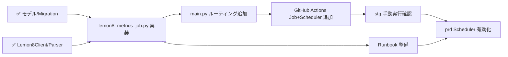

# Phase 3 ジョブ系 詳細作戦書（更新版）

> 更新日: 2026-03-13（実装状況を反映して既存作戦書を刷新）

---

## 概要

Lemon8投稿の指標（再生数・いいね・お気に入り・コメント）を定期収集し、`Lemon8Post` と `Lemon8PostHistory` を信頼できる時系列データとして運用可能にする。
スクレイピング劣化時でも **全体停止を避け**、監視で検知して手動復旧できる運用を目指す。

---

## 実装状況サマリ

### ✅ 完了済み

| 項目 | ファイル |
|------|---------|
| DB モデル（Lemon8Account / Lemon8Post / Lemon8PostHistory） | `backend/api/models/user_model.py`, `video_campaign_model.py` |
| Alembic migration | `backend/alembic/versions/lemon8_integration_001.py` |
| スクレイピングジョブ（インフルエンサー探索・Firestore保存） | `backend/api/jobs/lemon8_scraping_job.py` |
| スクレイピングサービス群（Lemon8Client / Parser / ScrapingService） | `backend/api/services/lemon8_*.py` |
| Admin API（インフルエンサー一覧・CSV出力・削除） | `backend/api/controllers/admin/lemon8_influencers_controller.py` |
| `JOB_TYPE=lemon8-influencer-scraper` のルーティング | `backend/main.py` (line 112-114) |
| GitHub Actions: stg/prd への lemon8-scraping-job デプロイ | `.github/workflows/deploy-stg-backend.yml`, `deploy-prd.yml` |
| prd Cloud Scheduler（毎週月曜 04:00 JST） | `deploy-prd.yml` |

### ❌ 未実装（本作戦の対象）

- `lemon8_metrics_job.py` — Lemon8Post のメトリクスを定期更新し Lemon8PostHistory を追記するジョブ
- `JOB_TYPE=lemon8-metrics-collector` のルーティング追加（`main.py`）
- GitHub Actions: stg/prd ワークフローへ `lemon8-metrics-collector` Cloud Run Job + Scheduler の追加
- 監視・Runbook の整備

---

## 仕様（凍結済み前提）

| 項目 | 内容 |
|------|------|
| `group_id` | 単体 unique（`Lemon8Post.group_id` に既存 unique 制約あり） |
| 実行間隔 | stg=手動, prd=1日1回（毎日 03:00 JST） |
| 失敗方針 | **fail-open** — 取得失敗時は前回値を維持、ジョブは継続 |
| 失敗時の挙動 | 1件失敗でも他の処理は続け、失敗件数をログに集約する |

---

## 実装ステップ

### Step 1: `lemon8_metrics_job.py` の実装

**対象ファイル:** `backend/api/jobs/lemon8_metrics_job.py`（新規）

既存の `instagram_metrics_job.py` / `tiktok_metrics_job.py` と同じパターンで実装する。

#### 処理フロー

```
対象抽出（Lemon8Post, deleted_at=None, post_url あり）
  → post_url ごとに Lemon8Client.fetch_post_html()
  → Lemon8Parser.parse_post_metrics() でメトリクス取得
  → Lemon8Post の read_count / digg_count / favorite_count / comment_count を更新
  → Lemon8PostHistory にスナップショットを追加
  → 失敗件数・成功件数・スキップ件数をログ出力
  → Slack 通知（成功/失敗）
```

#### 冪等性確保

- `Lemon8PostHistory.recorded_at` を **1時間バケット** で丸めて重複防止
  ```python
  recorded_at.replace(minute=0, second=0, microsecond=0)
  ```
- `lemon8_post_id + recorded_at` で upsert または insert-if-not-exists

#### 再利用する既存コード

| コード | ファイル |
|--------|---------|
| `Lemon8Client` | `backend/api/services/lemon8_client.py` |
| `Lemon8Parser.parse_post_metrics()` | `backend/api/services/lemon8_parser.py` |
| Slack 通知パターン | `lemon8_scraping_job.py` の `send_success_notification()` / `send_failure_notification()` |

---

### Step 2: `main.py` にルーティング追加

**対象ファイル:** `backend/main.py`

既存の `lemon8-influencer-scraper` の下に追加する。

```python
elif job_type == "lemon8-metrics-collector":
    from api.jobs.lemon8_metrics_job import run_lemon8_metrics_job
    await run_lemon8_metrics_job()
```

> `STAGING_DISABLED_JOBS` への追加は **しない**（stg でも動作確認したい）。

---

### Step 3: GitHub Actions へ Cloud Run Job + Scheduler を追加

#### stg ワークフロー (`deploy-stg-backend.yml`)

既存の `stg-lemon8-scraping-job` の後ろに追加:

```yaml
- name: Deploy Lemon8 Metrics Collector Cloud Run Job
  run: |
    gcloud run jobs deploy stg-lemon8-metrics-collector \
      --image $IMAGE \
      --region $REGION \
      --cpu 1 \
      --memory 1Gi \
      --task-timeout 3600s \
      --max-retries 1 \
      --parallelism 1 \
      --set-env-vars "JOB_TYPE=lemon8-metrics-collector,ENV=staging,..."
```

> stg では **Scheduler なし**（手動実行のみ）。コード側でのガードも不要（stg でも全件実行して動作確認する）。

#### prd ワークフロー (`deploy-prd.yml`)

既存の `prd-lemon8-scraping-job` の後ろに追加:

```yaml
- name: Deploy Lemon8 Metrics Collector Cloud Run Job
  run: |
    gcloud run jobs deploy prd-lemon8-metrics-collector \
      --image $IMAGE \
      --region $REGION \
      --cpu 1 \
      --memory 1Gi \
      --task-timeout 3600s \
      --max-retries 1 \
      --parallelism 1 \
      --set-env-vars "JOB_TYPE=lemon8-metrics-collector,ENV=production,..."

- name: Setup Lemon8 Metrics Collector Scheduler
  run: |
    # 既存 scheduler があれば update、なければ create（他 Scheduler と同パターン）
    SCHEDULE="0 3 * * *"  # 毎日 03:00 JST (= 18:00 UTC)
    # ... gcloud scheduler jobs create / update
```

---

### Step 4: 監視・Runbook

**対象ファイル:** `docs/runbook/lemon8_metrics_job.md`

以下の内容を記載する:

| 項目 | 内容 |
|------|------|
| 監視 KPI | 実行成功率、取得件数の異常低下（前日比 50% 未満）、パース失敗率 |
| Slack 通知 | ジョブ失敗時に `#alert` チャンネルへ通知（既存 Slack 通知フローを流用） |
| 手動再実行 | `gcloud run jobs execute prd-lemon8-metrics-collector --region=...` |
| 一時停止 | Cloud Scheduler を pause |
| ロールフォワード | 前回失敗分の再実行方法を記述 |

---

## テスト計画

### 単体テスト（手動確認）

- [ ] `parse_post_metrics()` が正しいメトリクスを返すか
- [ ] 1件失敗時に他の処理が継続されるか（例外混在ケース）
- [ ] `recorded_at` バケットで重複 History が作られないか

### 結合テスト（stg 環境）

- [ ] stg でジョブを手動実行
- [ ] `lemon8post` の各指標が更新されること
- [ ] `lemon8posthistory` に新レコードが追加されること
- [ ] 同一データを再実行しても History が重複しないこと

### prd 安定性確認

- [ ] Scheduler 初回起動ログ確認
- [ ] 24時間運転で失敗率と取得件数が正常範囲内

---

## 依存関係



---

## 完了判定（DoD）

- [ ] `lemon8_metrics_job.py` が存在し、`JOB_TYPE=lemon8-metrics-collector` で起動できる
- [ ] `Lemon8Post` の指標が実行ごとに更新される
- [ ] `Lemon8PostHistory` に重複なくスナップショットが追加される
- [ ] 1件失敗時もジョブが継続し、失敗情報がログに残る
- [ ] stg/prd の GitHub Actions ワークフローに Cloud Run Job が追加されている
- [ ] prd に Cloud Scheduler（毎日 03:00 JST）が設定されている
- [ ] 障害時の手動復旧手順が Runbook に文書化されている
