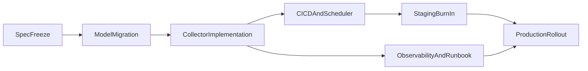

# Phase3 ジョブ系 詳細作戦書

## 目的

- Lemon8投稿の指標を定期更新し、`Lemon8Post` と `Lemon8PostHistory` を信頼できる時系列データとして運用可能にする。
- スクレイピング劣化時でも全体停止を避け、監視で検知して手動復旧できる運用にする。

## 成果物

- モデル/テーブル定義とAlembic migration。
- `lemon8_metrics_job.py` と `backend/main.py` の `JOB_TYPE` 追加。
- stg/prdのCloud Run Job + Scheduler設定（GitHub Actions経由）。
- 監視手順（失敗率・取得件数閾値・通知・再実行手順）。

## スコープ

### 対象ファイル

- [/Users/yazawakoki/develop/vimmy/backend/api/models/video_campaign_model.py](/Users/yazawakoki/develop/vimmy/backend/api/models/video_campaign_model.py)
- [/Users/yazawakoki/develop/vimmy/backend/api/models/user_model.py](/Users/yazawakoki/develop/vimmy/backend/api/models/user_model.py)
- [/Users/yazawakoki/develop/vimmy/backend/api/models/**init**.py](/Users/yazawakoki/develop/vimmy/backend/api/models/__init__.py)
- [/Users/yazawakoki/develop/vimmy/backend/alembic/versions](/Users/yazawakoki/develop/vimmy/backend/alembic/versions)
- [/Users/yazawakoki/develop/vimmy/backend/api/jobs/lemon8_metrics_job.py](/Users/yazawakoki/develop/vimmy/backend/api/jobs/lemon8_metrics_job.py)
- [/Users/yazawakoki/develop/vimmy/backend/main.py](/Users/yazawakoki/develop/vimmy/backend/main.py)
- [/Users/yazawakoki/develop/vimmy/.github/workflows/deploy-stg-backend.yml](/Users/yazawakoki/develop/vimmy/.github/workflows/deploy-stg-backend.yml)
- [/Users/yazawakoki/develop/vimmy/.github/workflows/deploy-prd.yml](/Users/yazawakoki/develop/vimmy/.github/workflows/deploy-prd.yml)

### 非対象

- 報酬計算ロジック本体の改修（別作戦書で扱う）。
- admin/userフロント表示改修（報酬系作戦書で扱う）。

## 実装ステップ

### 1. 仕様凍結（着手前）

- `Lemon8Post.group_id` 制約を確定。
  - 候補A: `group_id` 単体unique。
  - 候補B: `(video_entry_id, group_id)` 複合unique。
- ジョブ実行ポリシーを確定。
  - 実行間隔（例: 30分/60分）。
  - 1回あたり処理上限件数。
  - 失敗時リトライ回数。
- 障害時方針を固定。
  - デフォルトはfail-open（取得失敗時は前回値維持）。
  - 失敗率/取得件数の通知閾値。

### 2. データ層（モデル・migration）

- `Lemon8Post` と `Lemon8PostHistory` の最小列を定義。
  - 識別子、参照キー、指標、取得時刻、更新時刻。
- インデックス方針。
  - 検索頻度が高い `video_entry_id` / `group_id` / `collected_at` に索引。
- migration実装。
  - upgrade: テーブル作成・制約作成。
  - downgrade: 逆順削除。
- 冪等性確認。
  - 再デプロイ時に重複作成しない。
  - 既存データに影響を与えない。

### 3. ジョブ本体実装

- 処理順を固定実装。
  - `対象抽出 -> 外部取得 -> Lemon8Post更新 -> Lemon8PostHistory追加 -> entry再計算トリガ`
- 重複履歴の防止。
  - `post_id + collected_bucket` などで一意制御。
- 例外処理方針。
  - 1件失敗で全停止させない。
  - 失敗レコードをログへ集約。
- ログ設計。
  - 実行ID、対象件数、成功件数、失敗件数、失敗理由分類を出力。

### 4. 実行基盤（Cloud Run Job / Scheduler）

- `JOB_TYPE=lemon8-metrics-collector` で起動可能にする。
- stg/prd workflowへ追加。
  - Job create/update。
  - Scheduler create/update。
  - サービスアカウント/リージョン/cronの差分吸収。
- デプロイ時の安全策。
  - 先にstg適用し、初回稼働確認後にprd。

### 5. 監視・運用

- 監視KPIを定義。
  - 実行成功率。
  - 取得件数の異常低下。
  - パース失敗率。
- 通知設計。
  - 閾値超過時のSlack/LINE通知。
- 復旧Runbook。
  - 一時停止、手動再実行、リトライ、ロールフォワード手順。

## テスト計画

### 単体テスト

- 重複履歴防止ロジック。
- 例外混在時の継続処理。
- 指標更新時の値上書きルール。

### 結合テスト

- URL提出済みエントリを対象に、ジョブ1回実行でPost/Historyが期待通り更新される。
- 同一データ再実行でHistory重複が発生しない。

### stg検証

- Scheduler経由の自動起動確認。
- 24時間運転で失敗率と取得件数を確認。

## 依存関係

## 完了判定（ジョブ系DoD）

- `Lemon8Post` と `Lemon8PostHistory` が定期更新される。
- 同一データ再取得時に履歴重複を作らない。
- 失敗レコードがあってもジョブは継続し、失敗情報が追跡可能。
- stg/prdでScheduler駆動が安定稼働する。
- 障害時の通知と手動復旧手順が文書化されている。

