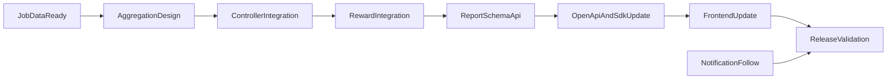

# Phase3 報酬系 詳細作戦書

## 目的

- Lemon8を既存のInstagram/TikTokと同列で扱い、`current_view_count` / `latest_view_count` / `total_views_count` の整合性を確保する。
- 報酬計算、レポート、通知、フロント表示が同一データ前提で一致する状態を作る。

## 実装原則（今回固定）

- 集計の単一情報源は `video_entry_id` ごとの「最新SNSメトリクス合算値」とする。
- controllerごとに式を持たず、backend側の共通関数へ寄せる。
- 欠損値は `None` ではなく `0` として扱い、合算は常に `int` で返す。
- Lemon8が未登録でも既存Instagram/TikTokの値は一切変えない（後方互換）。
- 報酬計算は「対象期間の最新値」ではなく既存仕様に合わせた基準（差分/累積）を維持し、Lemon8を加算するだけに留める。
- UI表示は「内訳の合計 = 合計報酬（見込み）」を必ず満たす。
- 金額計算の丸めは全項目で同じ規則（`floor` / `round` / `ceil` のいずれか）に統一し、backendとfrontendで二重計算しない。

## 成果物

- 全コントローラ集計ロジックのLemon8統合。
- `video_view_reward_job.py` の報酬反映更新。
- レポートデータ/スキーマ/APIレスポンスの拡張。
- admin/userフロントの `platform` 型と表示更新。
- OpenAPI再生成と `frontend/packages/apis` 反映。

## スコープ

### 対象ファイル（backend）

- [/Users/yazawakoki/develop/vimmy/backend/api/controllers/user/entries_controller.py](/Users/yazawakoki/develop/vimmy/backend/api/controllers/user/entries_controller.py)
- [/Users/yazawakoki/develop/vimmy/backend/api/controllers/public/campaigns_controller.py](/Users/yazawakoki/develop/vimmy/backend/api/controllers/public/campaigns_controller.py)
- [/Users/yazawakoki/develop/vimmy/backend/api/controllers/admin/entries_controller.py](/Users/yazawakoki/develop/vimmy/backend/api/controllers/admin/entries_controller.py)
- [/Users/yazawakoki/develop/vimmy/backend/api/controllers/user/campaigns_controller.py](/Users/yazawakoki/develop/vimmy/backend/api/controllers/user/campaigns_controller.py)
- [/Users/yazawakoki/develop/vimmy/backend/api/controllers/admin/users_controller.py](/Users/yazawakoki/develop/vimmy/backend/api/controllers/admin/users_controller.py)
- [/Users/yazawakoki/develop/vimmy/backend/api/controllers/admin/companies_controller.py](/Users/yazawakoki/develop/vimmy/backend/api/controllers/admin/companies_controller.py)
- [/Users/yazawakoki/develop/vimmy/backend/api/controllers/public/judge_controller.py](/Users/yazawakoki/develop/vimmy/backend/api/controllers/public/judge_controller.py)
- [/Users/yazawakoki/develop/vimmy/backend/api/jobs/video_view_reward_job.py](/Users/yazawakoki/develop/vimmy/backend/api/jobs/video_view_reward_job.py)
- [/Users/yazawakoki/develop/vimmy/backend/api/reports/data/campaign_report_data.py](/Users/yazawakoki/develop/vimmy/backend/api/reports/data/campaign_report_data.py)
- [/Users/yazawakoki/develop/vimmy/backend/api/schemas/campaign_report_schema.py](/Users/yazawakoki/develop/vimmy/backend/api/schemas/campaign_report_schema.py)
- [/Users/yazawakoki/develop/vimmy/backend/api/schemas/video_entry_schema.py](/Users/yazawakoki/develop/vimmy/backend/api/schemas/video_entry_schema.py)
- [/Users/yazawakoki/develop/vimmy/backend/api/schemas/post_history_schema.py](/Users/yazawakoki/develop/vimmy/backend/api/schemas/post_history_schema.py)
- [/Users/yazawakoki/develop/vimmy/backend/api/utils/line_notification_service.py](/Users/yazawakoki/develop/vimmy/backend/api/utils/line_notification_service.py)
- [/Users/yazawakoki/develop/vimmy/backend/api/utils/slack_notification_service.py](/Users/yazawakoki/develop/vimmy/backend/api/utils/slack_notification_service.py)

### 対象ファイル（frontend）

- [/Users/yazawakoki/develop/vimmy/frontend/admin-dashboard/src/pages/campaigns/CampaignReportPage.tsx](/Users/yazawakoki/develop/vimmy/frontend/admin-dashboard/src/pages/campaigns/CampaignReportPage.tsx)
- [/Users/yazawakoki/develop/vimmy/frontend/admin-dashboard/src/components/campaigns/report](/Users/yazawakoki/develop/vimmy/frontend/admin-dashboard/src/components/campaigns/report)
- [/Users/yazawakoki/develop/vimmy/frontend/admin-dashboard/src/pages/submissions/video/VideoCompletedPage.tsx](/Users/yazawakoki/develop/vimmy/frontend/admin-dashboard/src/pages/submissions/video/VideoCompletedPage.tsx)
- [/Users/yazawakoki/develop/vimmy/frontend/admin-dashboard/src/components/video/ViewHistoryDialog.tsx](/Users/yazawakoki/develop/vimmy/frontend/admin-dashboard/src/components/video/ViewHistoryDialog.tsx)
- [/Users/yazawakoki/develop/vimmy/frontend/user-app/src/pages/my-videos/MyVideosPage.tsx](/Users/yazawakoki/develop/vimmy/frontend/user-app/src/pages/my-videos/MyVideosPage.tsx)
- [/Users/yazawakoki/develop/vimmy/frontend/user-app/src/pages/campaigns/posts/CampaignPostsPage.tsx](/Users/yazawakoki/develop/vimmy/frontend/user-app/src/pages/campaigns/posts/CampaignPostsPage.tsx)
- [/Users/yazawakoki/develop/vimmy/frontend/user-app/src/types/campaign.types.ts](/Users/yazawakoki/develop/vimmy/frontend/user-app/src/types/campaign.types.ts)
- [/Users/yazawakoki/develop/vimmy/frontend/user-app/src/components/user/types/mypage.types.ts](/Users/yazawakoki/develop/vimmy/frontend/user-app/src/components/user/types/mypage.types.ts)
- [/Users/yazawakoki/develop/vimmy/frontend/user-app/src/components/user/sections/SubmittedVideosSection.tsx](/Users/yazawakoki/develop/vimmy/frontend/user-app/src/components/user/sections/SubmittedVideosSection.tsx)
- [/Users/yazawakoki/develop/vimmy/frontend/user-app/src/pages/featured-videos/FeaturedVideosPage.tsx](/Users/yazawakoki/develop/vimmy/frontend/user-app/src/pages/featured-videos/FeaturedVideosPage.tsx)
- [/Users/yazawakoki/develop/vimmy/frontend/packages/apis](/Users/yazawakoki/develop/vimmy/frontend/packages/apis)

### 非対象

- Lemon8メトリクス収集ジョブの内部実装（ジョブ系作戦書で扱う）。

## 実装ステップ

### 1. 集計ロジック共通化（backend）

- 追加する共通関数（配置候補: `backend/api/controllers` 配下の共通util）
  - `get_entry_platform_views(entry_id) -> {instagram:int, tiktok:int, lemon8:int}`
  - `get_entry_aggregated_views(entry_id) -> {current:int, latest:int, total:int}`
- 合算式を固定
  - `current_view_count = instagram_current + tiktok_current + lemon8_current`
  - `latest_view_count = instagram_latest + tiktok_latest + lemon8_latest`
  - `total_views_count = instagram_total + tiktok_total + lemon8_total`
- `None`/未投稿の扱い
  - URL未提出、投稿未取得、履歴なしは `0` とする。
  - マイナス値は不正値として `0` に丸める（ログ出力あり）。
- 期待実装
  - controller内で直接 `if platform == ...` を書かず、共通関数の戻り値だけ使う。

### 2. controller別の具体改修

- `backend/api/controllers/user/entries_controller.py`
  - entry詳細返却箇所で `lemon8` 分を加算。
  - `current_view_count/latest_view_count/total_views_count` を共通関数経由に置換。
- `backend/api/controllers/public/campaigns_controller.py`
  - 公開キャンペーン一覧のview表示合算を共通関数へ寄せる。
- `backend/api/controllers/admin/entries_controller.py`
  - 審査詳細・一覧のviewカラム算出にLemon8を追加。
- `backend/api/controllers/user/campaigns_controller.py`
  - ユーザー向けキャンペーン投稿一覧のview合算を統一。
- `backend/api/controllers/admin/users_controller.py` / `admin/companies_controller.py`
  - ユーザー/企業単位集計でLemon8を含む合算に変更。
- `backend/api/controllers/public/judge_controller.py`
  - 公開審査導線の表示値を同一式に統一。

### 3. 報酬ジョブの具体実装

- 対象: `backend/api/jobs/video_view_reward_job.py`
- 実装ポイント
  - 報酬対象viewの取得元にLemon8を追加（既存IG/TikTok取得処理と同じ抽象化レイヤで加算）。
  - 既存仕様が差分型なら `delta = current_total_with_lemon8 - rewarded_total` を使用。
  - 既存仕様が累積閾値型なら `current_total_with_lemon8` を閾値判定へ投入。
  - 重複付与防止キー（entry_id + reward_period + rule_id）は現行維持。
- 監査ログ追加
  - `entry_id`, `ig_views`, `tt_views`, `l8_views`, `sum_views`, `reward_amount`, `rule_id` を1行で記録。
  - 失敗時は例外分類（取得失敗/計算失敗/保存失敗）を出力。
- 丸め規則の統一
  - 再生報酬は `unit_price * views` の結果を backend 側で丸めて保存し、frontendは表示専用にする。
  - 例: `0.7 * 7339 = 5137.3` の場合、採用丸めが `floor` なら `5137`。
  - IG/TT/L8 で丸め規則を変えない。

### 4. レポート・スキーマ・履歴APIの具体実装

- `backend/api/reports/data/campaign_report_data.py`
  - 集計selectに `lemon8_views` を追加。
  - 合計行算出時に `total_views = ig + tt + l8` を明示。
- `backend/api/schemas/campaign_report_schema.py`
  - 追加フィールド: `lemon8_views`, 必要に応じて `lemon8_posts_count`。
- `backend/api/schemas/video_entry_schema.py`
  - 追加フィールド: `lemon8_url`, `lemon8_view_count`（命名は既存規約に合わせる）。
- `backend/api/schemas/post_history_schema.py`
  - 履歴要素へ `platform = "lemon8"` を許容。
  - Lemon8履歴項目（`read_count` など）を返せる形に拡張。
- API互換
  - 既存必須項目は変更しない。
  - 追加項目はoptional開始で段階移行し、frontend反映後に必須化可否を再判断。

### 5. 通知（LINE/Slack）の具体実装

- `backend/api/utils/line_notification_service.py`
  - URL提出通知テンプレートに `Lemon8 URL: {lemon8_url}` 行を追加。
  - 未入力時は行自体を出さない（空文字行禁止）。
- `backend/api/utils/slack_notification_service.py`
  - Slack block/text両方に同等情報を追加。
  - 既存のInstagram/TikTok表示順を崩さず、Lemon8を末尾追加。

### 6. フロントの具体実装

- 型拡張
  - `frontend/user-app/src/types/campaign.types.ts`
  - `frontend/user-app/src/components/user/types/mypage.types.ts`
  - `type Platform = "instagram" | "tiktok" | "lemon8"` に統一。
- admin表示
  - `CampaignReportPage.tsx`: Lemon8列追加、合計列との整合。
  - `components/campaigns/report/*`: グラフ/表データマッパーにLemon8追加。
  - `VideoCompletedPage.tsx` / `ViewHistoryDialog.tsx`: platform表示分岐にLemon8追加。
- user表示
  - `MyVideosPage.tsx` / `CampaignPostsPage.tsx` / `SubmittedVideosSection.tsx` / `FeaturedVideosPage.tsx`
  - 投稿カード、履歴表示、フィルタ条件にLemon8を追加。
- 実装ルール
  - `switch(platform)` の `default` で握りつぶさず、`never` チェックで網羅漏れ検出。
  - 報酬カードは「backendから受け取った金額」をそのまま表示し、frontendで再計算しない。

### 6.1 獲得報酬カード（今回指摘箇所）専用仕様

- 対象UI
  - `bg-gradient-to-r from-green-50 to-emerald-50 ...` の報酬サマリーカード（獲得報酬ブロック）。
- 表示項目
  - 投稿完了報酬
  - Instagram再生報酬（`単価 × IG再生数`）
  - TikTok再生報酬（`単価 × TT再生数`）
  - Lemon8再生報酬（`単価 × L8再生数`）※Phase3で追加
  - 特別報酬
  - 合計報酬（見込み）
  - 補足表示: 確定再生数 / 現在再生数
- 合計式（UI表示ルール）
  - `合計報酬（見込み） = 投稿完了報酬 + IG再生報酬 + TT再生報酬 + L8再生報酬 + 特別報酬`
  - 内訳のどれかが未提供なら `0` とみなす。
- 指摘値の確認ロジック（検証観点として固定）
  - 例示値: `1990 + 5137 + 322 + 0 = 7449` で合計一致。
  - 単価表示は式文字列、金額表示は丸め後整数を表示（式の小数と表示金額がズレても仕様として許容）。
- `確定再生数` と `現在` の定義を分離
  - `現在`: 最新取得値の合算（IG+TT+L8）。
  - `確定再生数`: 報酬計算に採用済みの基準再生数（締め処理済み値）。
  - そのため `確定再生数 > 現在` が発生し得るかを仕様で明記する。
  - 許容しない場合は `確定再生数 = min(確定再生数, 現在)` の補正をbackend側で実施。
- データ契約
  - UIが必要な値をAPIで明示返却する。
    - `posting_reward_yen`
    - `instagram_reward_yen`, `instagram_unit_price`, `instagram_views`
    - `tiktok_reward_yen`, `tiktok_unit_price`, `tiktok_views`
    - `lemon8_reward_yen`, `lemon8_unit_price`, `lemon8_views`
    - `special_reward_yen`
    - `estimated_total_reward_yen`
    - `confirmed_views_count`, `current_views_count`
  - UIはこれらを表示のみ行う。

### 7. OpenAPI再生成とSDK更新（具体手順）

- backend schema更新をマージしたらOpenAPIを再生成。
- `frontend/packages/apis` を再生成物で更新。
- user-app/admin-dashboard双方で型エラー0を確認。
- 反映順序
  - 1. backend deploy
  - 1. OpenAPI/SDK更新commit
  - 1. frontend deploy

## テスト計画

### 単体テスト

- 集計関数
  - ケースA: `ig=100, tt=200, l8=300` -> `sum=600`
  - ケースB: `ig=None, tt=200, l8=None` -> `sum=200`
  - ケースC: `ig=-1, tt=10, l8=0` -> `sum=10`（負数丸め）
- 報酬計算
  - 閾値直前/直後（例: 9,999 -> 10,000）で報酬発生境界を確認。
  - 再実行時に二重付与されないことを確認。
  - 単価×再生数の丸め規則が全SNSで同一であることを確認。
- 通知
  - Lemon8 URLあり/なしで期待文面になることをsnapshot確認。

### 結合テスト

- 同一entryを `user/public/admin` APIで取得し、3指標が一致することを確認。
- reward job 1回目で付与、2回目（同条件）で追加付与なしを確認。
- report APIの `lemon8_views` と admin画面の同値を比較。
- 獲得報酬カードで「内訳合計 = 合計報酬」が常に一致することを確認。
- `確定再生数` と `現在` が逆転するケースを投入し、仕様通り表示/補正されることを確認。

### 回帰テスト

- Instagram/TikTokのみデータで従来値が不変。
- Lemon8未連携キャンペーンで既存導線に影響なし。

### 検証用データセット（固定）

- Entry-1: IGのみ（既存回帰確認用）
- Entry-2: TTのみ（既存回帰確認用）
- Entry-3: L8のみ（新規経路確認用）
- Entry-4: IG+TT+L8（合算確認用）
- Entry-5: URLあり/メトリクス未取得（0埋め確認用）
- Entry-6: `確定再生数 > 現在` の逆転ケース（指摘UIの再現確認用）
- Entry-7: 小数丸め確認ケース（`unit_price=0.7`, `views=7339`）

## 依存関係

## リスクと対策

- 経路別に集計式がズレる
  - controller直書き禁止、共通関数のみ利用、ゴールデンケース比較をCIに組み込む。
- 報酬誤計算
  - 境界値テスト、再実行不変テスト、監査ログ出力を必須化。
- フロント型漏れ
  - `platform` 参照箇所を横断改修し、`never` チェックでコンパイル時に漏れ検出。

## 完了判定（報酬系DoD）

- view count 3指標がuser/public/adminで一致する。
- reward jobにLemon8が反映され、誤重複付与がない。
- report APIとadmin表示値が一致する。
- 通知にLemon8 URLが表示される。
- OpenAPI再生成後にfrontend型エラーが発生しない。
- 検証用7データセットで期待値表通りの結果が再現できる。
- 獲得報酬カードで「内訳合計・丸め・確定再生数/現在」の表示仕様が固定され、テストで再現できる。

