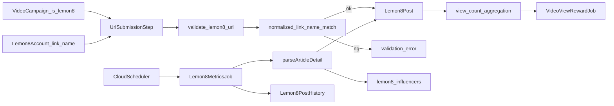

# Lemon8投稿計測統合作戦書 v3（審査反映版）

## 目的

- Lemon8投稿の `readCount` を Vimmy の動画計測・審査・報酬導線へ統合する。
- OAuth 不可前提で、**アカウント連携（URL/ユーザーネーム） + URL提出 + ownership検証 + 定期更新** を成立させる。
- 実装時の解釈差分をなくすため、**API契約、DB migration、Cloud Run運用、集計、通知、型生成**まで一貫して固定する。

## v3で確定した改訂ポイント

- `is_lemon8` をキャンペーン可否フラグとして導入（model/schema/admin UI）。
- SNS連携契約の波及先を `auth_schema` だけでなく `user_schema` にも拡張。
- URL検証方式は既存準拠で **submit と validate を分離**（`validate-lemon8-url` を個別エンドポイント化）。
- レポートは backend 集計だけでなく admin-dashboard 表示・型追従まで対象化。
- 通知（LINE/Slack）で Lemon8 URL 表示を追加。
- モデル追加時の登録点として `backend/api/models/__init__.py` を明示。
- OpenAPI再生成と `frontend/packages/apis` 更新を、リリース順序の必須工程に固定。

## スコープ

### 対象

- Phase1: Lemon8スクレイピング拡張（ArticleDetail 解析）
- Phase2: Lemon8 アカウント連携 + URL提出 + ownership検証
- Phase3: RDB 定期更新 + 履歴 + 集計 + 報酬 + レポート + 通知 + 型追従

### 非対象

- Lemon8公式OAuth
- Lemon8以外の新規SNS統合

## 実装前確定事項（仕様凍結）

- ownership照合キー正規化ルール
  - `@`除去、lowercase化、URL末尾 `/` 除去、URL decode、全角空白除去
- `Lemon8Post.group_id` の重複制約
  - 候補A: `group_id` 単体ユニーク
  - 候補B: `(video_entry_id, group_id)` 複合ユニーク
- Lemon8 metrics 更新ジョブ方式
  - 候補A: `lemon8-metrics-collector` 独立 job
  - 候補B: 既存 metrics ジョブへの統合（推奨しない）
- HTML構造変化時の障害方針
  - fail-open/fail-close、通知閾値、手動復旧手順を先に固定

## 全体アーキテクチャ

## Phase1: スクレイピングサービス拡張

### 目的

- 投稿詳細HTMLから `$ArticleDetail+{groupId}` を抽出し、`read_count` などを取得する。

### 変更対象

- `backend/api/services/lemon8_scraping_service.py`
- `backend/api/jobs/lemon8_scraping_job.py`（必要時）

### 実装方針

- `parse_article_detail_from_html()` を追加。
- 取得項目: `read_count`, `digg_count`, `favorite_count`, `comment_count`, `article_class`, `publish_time`
- 追加HTTP呼び出しは行わず、解析失敗時はログ記録のうえ継続。

### DoD

- Firestore `env/{env}/lemon8_influencers` に追加項目が保存される。
- 既存一覧/CSV/削除APIに回帰がない。

## Phase2: アカウント連携 + URL提出（ownership必須）

### 2-1. キャンペーン設定

- `is_lemon8` を導入し、有効キャンペーンのみ Lemon8 入力欄を表示。
- 変更対象
  - `backend/api/models/video_campaign_model.py`
  - `backend/api/schemas/video_campaign_schema.py`
  - `frontend/admin-dashboard/src/pages/campaigns/VideoCampaignCreatePage.tsx`
  - `frontend/admin-dashboard/src/pages/campaigns/VideoCampaignEditPage.tsx`

### 2-2. SNS連携契約（波及を明示）

- 連携一覧 API に `lemon8_accounts` を追加。
- 変更対象
  - `backend/api/models/user_model.py`
  - `backend/api/routes/user/social_route.py`
  - `backend/api/controllers/user/social_controller.py`
  - `backend/api/schemas/auth_schema.py`
  - `backend/api/schemas/user_schema.py`

### 2-3. URL提出契約（submit と validate を分離）

- `submit_url` 契約へ `lemon8_url` を追加。
- `validate-lemon8-url` を新設し、ownership検証は validate 側で実行。
- 変更対象
  - `backend/api/schemas/video_entry_schema.py`
  - `backend/api/routes/user/entries_route.py`
  - `backend/api/controllers/user/entries_controller.py`

### 2-4. ownershipチェック

- URL から抽出した `linkName` と `Lemon8Account.link_name` の一致を必須化。
- 不一致時は 4xx で reject（理由文言を返却）。
- 正規化ルールは「実装前確定事項」に従う。

### 2-5. user-app導線

- `SnsAccountSection` に Lemon8連携 UI を追加。
- `UrlSubmissionStep` に Lemon8 URL 入力・validate 呼び出しを追加。
- 未連携時は Lemon8 URL 提出を不可にする。
- 変更対象（重点）
  - `frontend/user-app/src/components/user/sections/SnsAccountSection.tsx`
  - `frontend/user-app/src/pages/campaigns/video/steps/UrlSubmissionStep.tsx`
  - `frontend/user-app/src/providers/LineAuthProvider.tsx`（必要時）

### 2-6. admin審査導線

- URL審査一覧/詳細で Lemon8 投稿を表示可能にする。
- 変更対象（重点）
  - `frontend/admin-dashboard/src/pages/campaigns/components/UrlCheckTable.tsx`
  - `frontend/admin-dashboard/src/components/video-detail/VideoPostInfo.tsx`
  - `frontend/admin-dashboard/src/pages/video/VideoEntryDetailPage.tsx`

### Phase2 DoD

- Lemon8有効キャンペーンでのみ入力欄が表示される。
- `lemon8_url` の submit/validate 契約が OpenAPI に反映される。
- ownership 不一致は validate API が理由付きで拒否する。
- admin審査画面で Lemon8 投稿が確認できる。

## Phase3: 定期更新 + 集計/報酬/レポート統合

### 3-1. RDBモデル + migration

- 追加モデル
  - `Lemon8Account`（`backend/api/models/user_model.py`）
  - `Lemon8Post`, `Lemon8PostHistory`（`backend/api/models/video_campaign_model.py`）
- 登録点
  - `backend/api/models/__init__.py`
- migration
  - `backend/alembic/versions`
  - `backend/alembic/env.py`（必要時）

### 3-2. ジョブ実装

- `backend/api/jobs/lemon8_metrics_job.py` 追加
- 更新順序: 取得 -> 最新更新 -> 履歴追加 -> entry再計算
- `backend/main.py` の `JOB_TYPE` に `lemon8-metrics-collector` を追加

### 3-3. CI/CD・スケジューラ

- Cloud Run Job/Scheduler 追加
- 変更対象
  - `.github/workflows/deploy-stg-backend.yml`
  - `.github/workflows/deploy-prd.yml`

### 3-4. view集計反映（全経路）

- `current_view_count/latest_view_count/total_views_count` を Lemon8 含みへ統一。
- 変更対象
  - `backend/api/controllers/user/entries_controller.py`
  - `backend/api/controllers/public/campaigns_controller.py`
  - `backend/api/controllers/admin/entries_controller.py`
  - `backend/api/controllers/user/campaigns_controller.py`
  - `backend/api/controllers/admin/users_controller.py`
  - `backend/api/controllers/admin/companies_controller.py`
  - `backend/api/controllers/public/judge_controller.py`
  - `backend/api/jobs/video_view_reward_job.py`

### 3-5. レポート集計 + 表示

- backend の IG/TikTok 前提集計へ Lemon8 を追加。
- admin-dashboard の表示/型を追従。
- 変更対象
  - `backend/api/reports/data/campaign_report_data.py`
  - `backend/api/schemas/campaign_report_schema.py`
  - `frontend/admin-dashboard/src/pages/campaigns/CampaignReportPage.tsx`
  - `frontend/admin-dashboard/src/components/campaigns/report/*`

### 3-6. 投稿一覧/履歴APIの追従

- `video_entry/post_history` のレスポンスへ Lemon8 を追加。
- 変更対象
  - `backend/api/schemas/video_entry_schema.py`
  - `backend/api/schemas/post_history_schema.py`
  - `backend/api/routes/user/entries_route.py`（履歴API追加時）

### 3-7. 通知の追従

- URL提出通知（LINE/Slack）の Lemon8 表示対応。
- 変更対象
  - `backend/api/utils/line_notification_service.py`
  - `backend/api/utils/slack_notification_service.py`（必要時）

### 3-8. フロント platform 型の拡張

- `"instagram" | "tiktok"` 前提に `"lemon8"` を追加。
- 変更対象（重点）
  - `frontend/user-app/src/pages/my-videos/MyVideosPage.tsx`
  - `frontend/user-app/src/pages/campaigns/posts/CampaignPostsPage.tsx`
  - `frontend/admin-dashboard/src/pages/submissions/video/VideoCompletedPage.tsx`
- 変更対象（追加）
  - `frontend/user-app/src/types/campaign.types.ts`
  - `frontend/user-app/src/components/user/types/mypage.types.ts`
  - `frontend/user-app/src/components/user/sections/SubmittedVideosSection.tsx`
  - `frontend/user-app/src/pages/featured-videos/FeaturedVideosPage.tsx`
  - `frontend/admin-dashboard/src/components/video/ViewHistoryDialog.tsx`

### Phase3 DoD

- Lemon8Post/Lemon8PostHistory が定期更新され、重複登録しない。
- view集計が user/public/admin で一貫する。
- 報酬計算に Lemon8 が反映される。
- レポート集計と admin表示が Lemon8 を含む。
- URL提出通知に Lemon8 URL が表示される。

## API契約（固定）

### submit URL

- `POST /api/user/entries/video/{entry_id}/url`
- Request: `instagram_url?`, `tiktok_url?`, `lemon8_url?`
- Rule: 3つのうち少なくとも1つ必須

### validate URL（分離）

- `POST /api/user/entries/video/{entry_id}/validate-instagram-url`
- `POST /api/user/entries/video/{entry_id}/validate-tiktok-url`
- `POST /api/user/entries/video/{entry_id}/validate-lemon8-url`（新設）
- Rule: validate で ownership 判定、submit は保存責務に限定

## リリース順序（固定）

1. DB migration 適用
2. backend deploy（job/scheduler 含む）
3. OpenAPI 再生成 + `frontend/packages/apis` 更新
4. frontend deploy（user-app/admin-dashboard）

## 受け入れ条件（最終DoD）

- `is_lemon8` がキャンペーン作成/編集/取得で一貫して扱える。
- `lemon8_accounts` と `lemon8_url` が API 契約に反映され、型生成後もエラーがない。
- `validate-lemon8-url` で ownership 不一致を理由付きで拒否できる。
- migration 再実行時に Lemon8 系テーブルの重複作成/重複データが発生しない。
- `current_view_count/latest_view_count/total_views_count` が Lemon8 含みで更新される。
- stg/prd workflow で Lemon8 metrics job と scheduler が作成/更新される。
- campaign report の backend 集計値と admin 表示値が一致する。
- スクレイピング劣化時の検知（失敗率/取得件数閾値）と手動復旧手順が運用ドキュメント化される。
